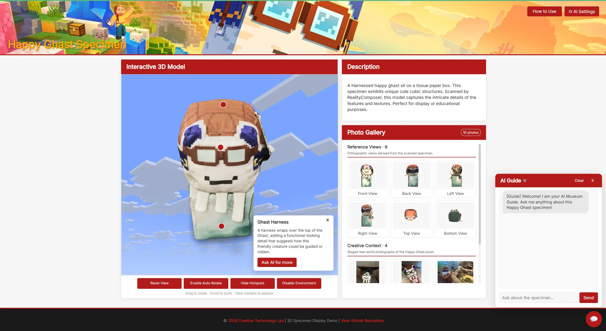
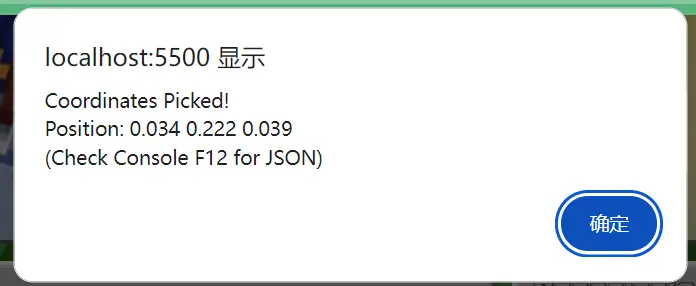
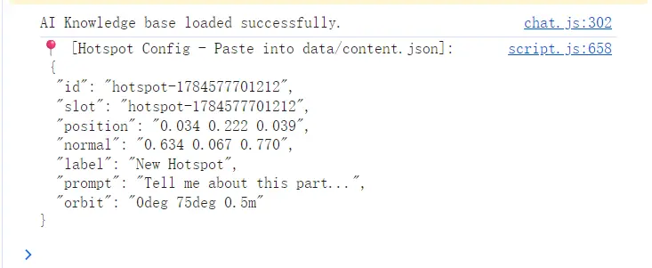

# Developer and Configuration Guide

This is a static HTML, CSS, and JavaScript demo. Content, themes, interface text, and most AI behavior can be changed without editing the main application logic.

## Project Structure

```text
css/          Interface, responsive layout, and theme styles
data/         Exhibit content, text, theme, onboarding, and AI configuration
fonts/        Local theme fonts
img/          Banner, gallery, and interface images
js/           Model viewer, gallery, UI, and AI behavior
models/       Browser-ready 3D models
index.html    Main page structure
```

At startup, `js/script.js` loads the JSON configuration files and builds the interface. Google's `<model-viewer>` renders the optimized GLB model. `js/chat.js` loads `data/knowledge.md` and connects directly to the visitor's OpenAI-compatible endpoint when the optional AI Guide is used.

## Run Locally

Serve the project root through HTTP so the browser can load JSON and Markdown files. In VS Code, the simplest option is to install the **Live Server** extension, open `index.html`, and select **Go Live**.

You can also use Python from the project root:

```bash
python -m http.server
```

Then open the address printed by the server. Opening `index.html` directly from the file system may block configuration requests.

## Configuration Overview

| File | Purpose |
| --- | --- |
| `data/content.json` | Specimen, model, hotspots, gallery categories, and images |
| `data/ui_text.json` | Buttons, status labels, error messages, and other interface text |
| `data/onboarding.json` | How to Use introduction and steps |
| `data/theme.json` | Active theme, colors, fonts, and theme-specific options |
| `data/ai_config.json` | AI response behavior, compatibility settings, and viewer actions |
| `data/knowledge.md` | Curated exhibit knowledge supplied to the AI Guide |

### Exhibit and Gallery Content

Common fields in `data/content.json`:

| Field | Type | Description |
| --- | --- | --- |
| `title` | string | Exhibit title |
| `description` | string | Main specimen introduction |
| `modelUrl` | string | Path to the optimized `.glb` model |
| `bannerUrl` | string | Path to the page banner |
| `hotspots` | array | Interactive model features and their camera views |
| `galleryCategories` | object | Gallery headings, descriptions, labels, and order |
| `images` | array | Gallery images and their curated AI context |

Each hotspot should provide a stable `id`, model-viewer `position` and `normal`, a local `description`, an optional AI `prompt`, and the target camera `orbit`. The same hotspot ID becomes an allowed AI viewer action, so keep IDs stable when editing content.

Gallery images should include the following fields:

| Field | Purpose |
| --- | --- |
| `id` | Stable image identifier |
| `src` | Image path |
| `label` | Visible image title |
| `category` | Matching gallery category key |
| `description` | Short local explanation |
| `visualFacts` | Facts a text-only AI may safely use |
| `aiPrompt` | Suggested question for **Ask AI** |

Reference images and creative photographs should use separate categories. Write `visualFacts` as concrete observations rather than asking the model to infer unseen image details.

#### Content Authoring Rules

* Keep hotspot and image `id` values unique and stable after publication.
* Use relative asset paths and preserve filename capitalization for GitHub Pages.
* Match every image `category` to a key in `galleryCategories`.
* Keep local descriptions concise and write `visualFacts` only from details that can be confirmed from the image or exhibit record.
* Update the gallery image context and `data/knowledge.md` together when a new specimen needs different factual coverage.

### Interface Text and Onboarding

Use `data/ui_text.json` for short interface labels, status messages, and reusable error text. Use `data/onboarding.json` for the How to Use title, introduction, ordered steps, and dismiss button. Keeping these strings outside JavaScript makes content updates and future localization easier.

### Themes

Set `activeTheme` in `data/theme.json` to `minecraft`, `cornell`, or another configured theme. Each theme defines its name, colors, fonts, and optional chat icon.

<p align="center">
  
  
</p>

When adding a theme:

1. Add its configuration under `themes`.
2. Reuse the existing CSS variables and component classes.
3. Check model controls, dialogs, gallery navigation, focus styles, and the floating AI panel at narrow widths.

### Site Icon

The browser tab icon is `img/favicon.png`, referenced directly by `index.html`. To change it, replace that file with another compatible PNG while keeping the same filename and path. No JavaScript or JSON configuration changes are required.

### AI Guide

`data/ai_config.json` controls the welcome message, model capabilities, generation settings, extra system instructions, and configured viewer actions.

| Field | Purpose |
| --- | --- |
| `capabilities.vision` | Indicates whether image input is expected; currently `false` |
| `capabilities.galleryContextMode` | Selects curated text context for gallery questions |
| `generation.maxTokens` | Requested response limit |
| `generation.temperature` | Provider-supported response variation |
| `generation.tokenParameter` | `auto`, `max_tokens`, or `max_completion_tokens` |
| `generation.responseInstructions` | Desired response length and completion behavior |
| `actions.default_view` | Default camera orbit used by Reset View and AI actions |

The client supports common OpenAI-compatible Chat Completions APIs and retries known token-parameter or temperature compatibility errors. Providers may still reject browser CORS requests or use a different protocol.

Viewer actions use the text marker `[ACTION: action_id]`. Only configured actions and hotspot IDs are accepted, and only the first valid action in one response is executed.

### Knowledge Base

Keep `data/knowledge.md` focused on verified specimen facts, scan context, visible features, and useful interpretation. Gallery-specific observations belong in the corresponding image's `visualFacts`; this gives non-multimodal models enough context when the visitor selects **Ask AI**.

## Common Update Tasks

### Replace the Specimen

1. Add the browser-ready GLB file under `models/`.
2. Update `modelUrl`, the exhibit title, and description.
3. Rebuild hotspot positions, normals, and camera orbits for the new model.
4. Replace gallery content and update `data/knowledge.md`.
5. Test Reset View, auto-rotation, hotspots, and AI actions together.

The current model is Draco-optimized for web delivery. Keep any large original scan archived separately and publish only the optimized model when possible.

#### Model Resource Convention

Store the browser-ready optimized model in `models/` and reference it through `modelUrl`. Keep source scans or other large working files outside the deployed asset path when possible. A replacement model requires a new hotspot pass because positions, normals, and camera orbits are specific to its geometry and scale.

### Add a Gallery Image

1. Add the image under `img/`.
2. Add an entry to `images` with a matching category.
3. Supply a local description, concrete `visualFacts`, and a focused `aiPrompt`.
4. Check the gallery count, modal navigation, and layout at multiple window sizes.

### Add or Rename a Hotspot

Update its content and camera configuration together. If an ID changes, also review prompts or documentation that refer to its viewer action. Selecting a hotspot should pause auto-rotation and focus the intended feature from any previous turntable angle.

Use this workflow for a new hotspot:

1. Pick a surface coordinate with the developer coordinate picker.
2. Paste the generated template into `data/content.json`.
3. Replace placeholder text and add the local `description`.
4. Adjust `orbit` until the selected feature is clearly visible.
5. Test the hotspot after rotating the model and with auto-rotation enabled.

### Pick Hotspot Coordinates (Developer Mode)

The model includes a coordinate picker to speed up hotspot placement. With `DEBUG_MODE` enabled in `js/script.js`, hold `Alt` (`Option` on macOS) and click a point on the 3D model. A confirmation dialog shows the picked position, and the browser console (`F12`) prints a JSON hotspot template that can be pasted into `data/content.json`.

<p align="center">
  
</p>

The generated template contains a unique `id` and `slot`, plus the clicked surface `position`, `normal`, a placeholder `label`, `prompt`, and a starting camera `orbit`. It reports the clicked surface coordinates rather than complete model metadata or the current camera state.

<p align="center">
  
</p>

After pasting the template, replace the placeholder label and prompt, add a local `description`, and adjust the camera orbit as needed. Test the marker from several model rotations before treating the position as final.

> [!NOTE]
> The coordinate picker is intended for authoring. Set `DEBUG_MODE` to `false` before a public release if visitors should not be able to trigger the Alt+click dialog or see configuration output in their browser console.

## Testing Checklist

* Serve the site through HTTP and check the browser console.
* Parse all files under `data/` after changing JSON.
* Check both Minecraft and Cornell themes.
* Check desktop, narrow-screen, keyboard, and focus behavior.
* Test hotspots after the model has auto-rotated.
* Test gallery navigation and active AI context.
* Test BYOK session storage, remembered storage, connection status, and clearing credentials.
* Never commit API keys or other private credentials. The repository does not use `.env` at runtime; `.gitignore` excludes `.env` and `.env.local` as a local safety measure.

GitHub Pages can deploy the repository as static files; no build step is required. Keep asset paths relative and preserve filename capitalization for case-sensitive hosting.
