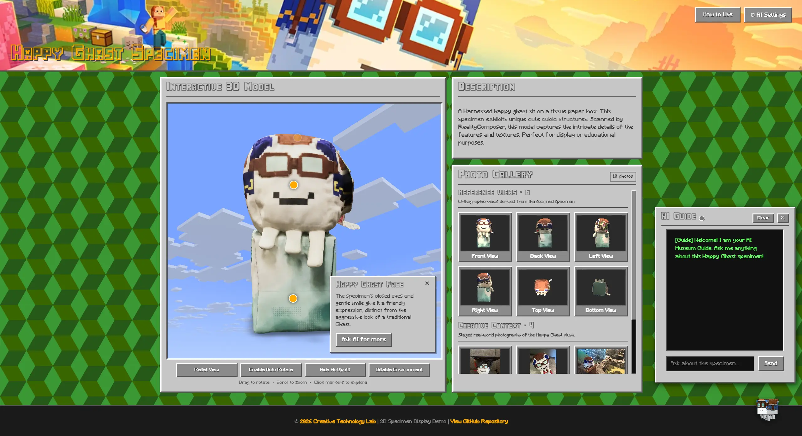
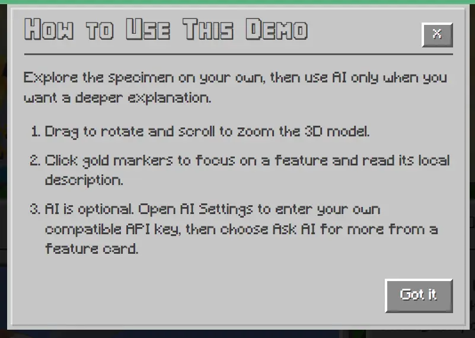
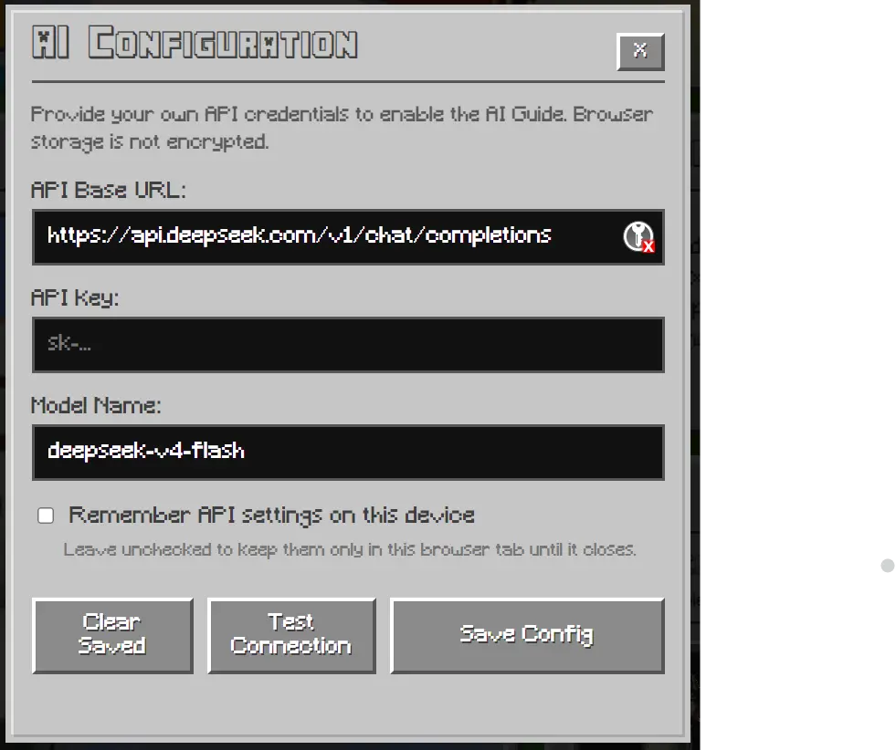

# User Guide

This demo presents a 3D-scanned specimen through an interactive model, a photo gallery, local exhibit notes, and an optional AI Guide.

  

## How to Use

Select **How to Use** in the page controls at any time to reopen the short in-page introduction. It summarizes the essential model controls, hotspots, gallery, and optional AI Guide without changing the model layout.

  

## Explore the Model

| Control | What it does |
| --- | --- |
| Drag | Rotate the model |
| Scroll or pinch | Zoom in and out |
| Hotspot | Focus on a feature and open its local description |
| Ask AI for more | Send the selected feature to the optional AI Guide |
| Reset View | Restore the default camera position |
| Auto Rotate | Start or pause automatic rotation |
| Environment | Show or hide the environment lighting |

Selecting a hotspot pauses auto-rotation so the requested feature remains in view. Hotspot descriptions work locally and do not require an API key.

## Browse the Photo Gallery

The gallery separates two kinds of material:

* **Reference Views** document the scanned specimen from standard directions.
* **Creative Context** contains real-world photographs of the Happy Ghast plush.

Select an image to open the larger preview. Use the side buttons or the left and right arrow keys to move between images. The counter shows the current image and the total in its category.

The **Ask AI** button sends the image's curated title, description, and visual notes to the AI Guide. This allows text-only models to discuss the image without receiving the image itself.

## Use the AI Guide

The AI Guide is optional. Open it from the Happy Ghast button in the lower-right corner, then open **AI Settings** and enter:

1. An OpenAI-compatible Chat Completions endpoint.
2. Your API key.
3. A model name supported by that provider.

Enter the complete Chat Completions URL supplied by the provider, including a path such as `/v1/chat/completions` when required. The demo sends requests to the exact URL entered and does not append an API path automatically.

Use **Test Connection** to check the settings before chatting. The status indicator in the guide and its hover panel shows whether AI is unconfigured, configured, verified, or unavailable.

  

> [!NOTE]
> Providers differ in supported models, request parameters, rate limits, and browser CORS policies. A valid key does not guarantee that every endpoint can be called directly from a browser.

### API Key Storage

If **Remember API settings on this device** is unchecked, the settings remain in `sessionStorage` and are removed when the browser tab session ends. If checked, they remain in `localStorage` until cleared.

> [!WARNING]
> Browser storage is not encrypted. Do not remember a sensitive key on a shared or public device. Use **Clear Saved** when finished.

BYOK is the intended design: visitors provide their own compatible endpoint, key, and model directly in the browser. The repository does not include or read `.env`, and `.gitignore` excludes `.env` and `.env.local` to reduce the risk of accidentally committing local notes or credentials. Because this is a static site with no server-side secret storage, `.env` cannot configure the deployed AI Guide.

## Known Limitations

* The AI Guide is optional; the model, local hotspot descriptions, and gallery work without an API key.
* Gallery questions use curated text context when the selected model does not support image input. The guide should not be treated as if it directly viewed the photograph.
* Direct browser requests depend on each provider's endpoint compatibility, CORS policy, account permissions, and rate limits.
* The demo is designed for modern browsers with WebGL support. If the 3D model does not load, check the browser console and try a current desktop browser.

## Keyboard and Accessibility

* Use `Tab` and `Shift + Tab` to move between controls.
* Press `Enter` or `Space` to activate focused buttons.
* Use the arrow keys to navigate an open gallery preview.
* Press `Escape` to close dialogs, image previews, or the AI Guide.

## Common AI Errors

| Error | Likely cause |
| --- | --- |
| 401 | The API key is invalid or expired |
| 402 | The account has insufficient balance or credits |
| 403 | The key cannot access the requested service or model |
| 404 | The endpoint or model name was not found |
| 429 | The provider's rate limit was reached |
| Network/CORS error | The provider does not allow direct browser requests, or the service is unreachable |

The 3D model, hotspots, and gallery remain usable when the AI Guide is not configured.
